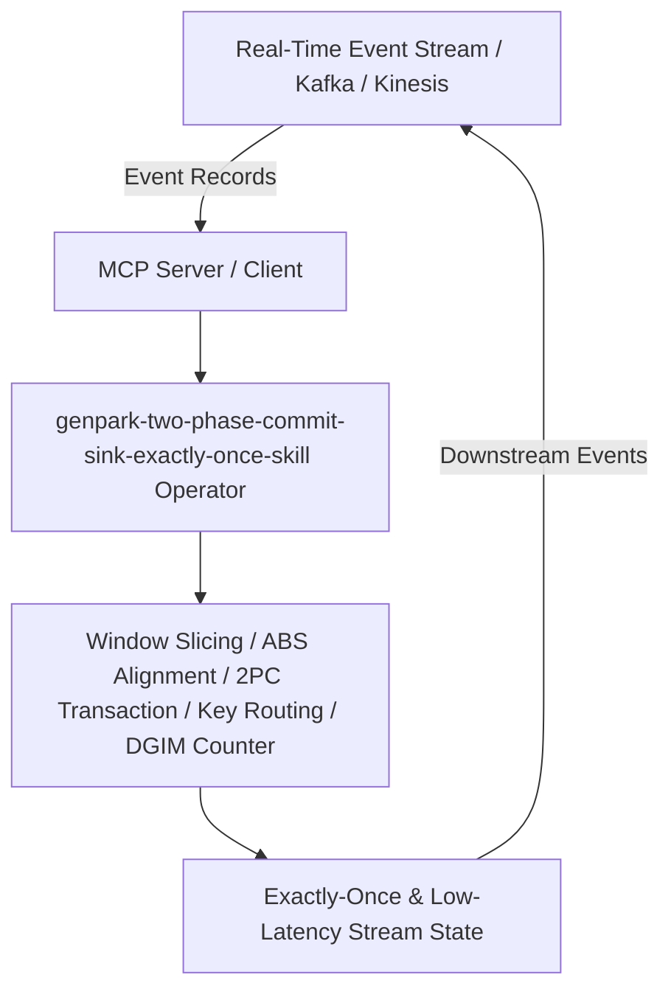

# genpark-two-phase-commit-sink-exactly-once-skill

[](https://github.com/alphaparkinc/genpark-two-phase-commit-sink-exactly-once-skill)
[](https://python.org)
[](#)
[](#)
[](LICENSE)

> Transactional Two-Phase Commit (2PC) stream sink coordinator guaranteeing end-to-end exactly-once delivery across failure recoveries.

## Architecture Overview



## Features
- **0 External Pip Dependencies**: Pure Python standard library implementation.
- **MCP Protocol Ready**: Includes Model Context Protocol server script (`mcp_server.py`).
- **Production Standard**: Verified out-of-order event handling, stream barrier alignment, and transactional 2PC sinks.

## Quick Start
```bash
python example_usage.py
```
